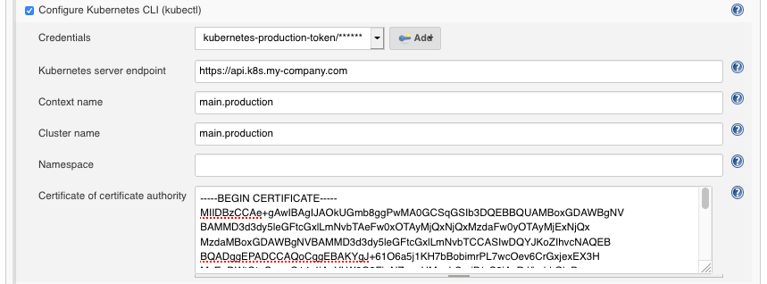

# Kubernetes CLI Plugin

[](https://travis-ci.org/jenkinsci/kubernetes-cli-plugin)
[](https://coveralls.io/github/jenkinsci/kubernetes-cli-plugin?branch=master)

Allows you to configure [kubectl][kubectl] in your job to interact with Kubernetes clusters.
Any tool built on top of `kubectl` can then be used from your pipelines to perform deployments, e.g. [kubernetes-deploy][kubernetes-deploy].

*Initially extracted and rewritten from the [Kubernetes Plugin][kubernetes-plugin].*

```groovy
// Example when used in a pipeline
node {
  stage('Apply Kubernetes files') {
    withKubeConfig([credentialsId: 'user1', serverUrl: 'https://api.k8s.my-company.com']) {
      sh 'kubectl apply -f my-kubernetes-directory'
    }
  }
}
```

## Prerequisites
* A jenkins installation running version 2.60.3 or higher.
* An executor with `kubectl` installed (tested against [v1.8 to v1.13][travis-config] included).
* A Kubernetes cluster.

## Supported credentials
The following types of credentials are supported and can be used to authenticate against Kubernetes clusters:
* Token, as secrets (see [Plain Credentials plugin][plain-credentials-plugin])
* Plain KubeConfig files (see [Plain Credentials plugin][plain-credentials-plugin])
* Username and Password (see [Credentials plugin][credentials-plugin])
* Certificates (see [Credentials plugin][credentials-plugin])
* OpenShift OAuth tokens, as secrets (see [Kubernetes Credentials plugin][kubernetes-credentials-plugin])

## Quick usage guide
The parameters have a slightly different effect depending if a plain KubeConfig file is provided.

### Parameters (without KubeConfig file)
| Name            | Mandatory | Description   |
| --------------- | --------- | ------------- |
| `credentialsId` | yes       | The Jenkins ID of the credentials. |
| `serverUrl`     | yes       | URL of the API server's. |
| `caCertificate` | no        | Cluster Certificate Authority used to validate the API server's certificate. The validation is skipped if the parameter is not provided. |
| `clusterName`   | no        | Name of the generated Cluster configuration. (default: `k8s`) |
| `namespace`     | no        | Namespace for the Context. |
| `contextName`   | no        | Name of the generated Context configuration. (default: `k8s`) |

### Parameters (with KubeConfig file)

The plugin writes the plain KubeConfig file and doesn't change any other field if only `credentialsId` is filled.
The recommended way to use a single KubeConfig file with multiples clusters, users, and default namespaces is to
configure a Context for each of them, and use the `contextName` parameter to switch between them (see [Kubernetes documentation][multi-clusters]).

| Name            | Mandatory | Description   |
| --------------- | --------- | ------------- |
| `credentialsId` | yes       | The Jenkins ID of the plain KubeConfig file. |
| `serverUrl`     | no        | URL of the API server's. This will create a new `cluster` block and modify the current Context to use it. |
| `caCertificate` | no        | Cluster Certificate Authority used to validate the API server's certificate if a `serverUrl` was provided. The validation is skipped if the parameter is not provided. |
| `clusterName`   | no        | Modifies the Cluster of the current Context. Also used for the generated `cluster` block if a `serverUrl` was provided. |
| `namespace`     | no        | Modifies the Namespace of the current Context. |
| `contextName`   | no        | Switch the current Context to this name. The Context must already exist in the KubeConfig file. |


### Using the plugin in a Pipeline
The `kubernetes-cli` plugin provides the function `withKubeConfig()` for Jenkins Pipeline support.
You can go to the *Snippet Generator* page under the *Pipeline Syntax* section in Jenkins, select
*withKubeConfig: Setup Kubernetes CLI* from the *Sample Step* dropdown, and it will provide you configuration
interface for the plugin. After filling the entries and click *Generate Pipeline Script* button, you will get the sample scripts which can be used
in your Pipeline definition.

Example:
```groovy
node {
  stage('List pods') {
    withKubeConfig([credentialsId: '<credential-id>',
                    caCertificate: '<ca-certificate>',
                    serverUrl: '<api-server-address>',
                    contextName: '<context-name>',
                    clusterName: '<cluster-name>',
                    namespace: '<namespace>'
                    ]) {
      sh 'kubectl get pods'
    }
  }
}
```

### Using the plugin from the web interface
1. Within the Jenkins dashboard, select a Job and then select "Configure"
2. Scroll down and click the "Add build step" dropdown
3. Select "Configure Kubernetes CLI (kubectl)"
4. In the "Credential" dropdown, select the credentials to authenticate on the cluster or the kubeconfig stored in Jenkins.



## Generating Kubernetes credentials
The following example describes how you could use the token of a `ServiceAccount` to access the Kubernetes cluster from Jenkins.
The result depends of course on the permissions you have.

```bash
# Create a ServiceAccount named `jenkins-robot` in a given namespace.
$ kubectl -n <namespace> create serviceaccount jenkins-robot

# The next line gives `jenkins-robot` administator permissions for this namespace.
# * You can make it an admin over all namespaces by creating a `ClusterRoleBinding` instead of a `RoleBinding`.
# * You can also give it different permissions by binding it to a different `(Cluster)Role`.
$ kubectl -n <namespace> create rolebinding jenkins-robot-binding --clusterrole=cluster-admin --serviceaccount=jenkins-robot

# Get the name of the token that was automatically generated for the ServiceAccount `jenkins-robot`.
$ kubectl -n <namespace> get serviceaccount jenkins-robot -o go-template --template='{{range .secrets}}{{.name}}{{"\n"}}{{end}}'
jenkins-robot-token-d6d8z

# Retrieve the token and decode it using base64.
$ kubectl -n <namespace> get secrets jenkins-robot-token-d6d8z -o go-template --template '{{index .data "token"}}' | base64 -D
eyJhbGciOiJSUzI1NiIsImtpZCI6IiJ9.eyJpc3MiOiJrdWJlcm5ldGVzL3NlcnZpY2V[...]
```

On Jenkins, navigate in the folder you want to add the token in, or go on the main page.
Then click on the "Credentials" item in the left menu and find or create the "Domain" you want.
Finally, paste your token into a `Secret text` credential. The ID is the `credentialsId` you need to use in the plugin configuration.

## Development

### Building and testing
To build the extension, run:
```bash
mvn clean package
```
and upload `target/kubernetes-cli.hpi` to your Jenkins installation.

To run the tests:
```bash
mvn clean test
```

### Perform a release
```bash
mvn release:prepare release:perform
```

[travis-config]:.travis.yml
[credentials-plugin]:https://github.com/jenkinsci/credentials-plugin
[kubernetes-plugin]:https://github.com/jenkinsci/kubernetes-plugin
[kubernetes-credentials-plugin]:https://github.com/jenkinsci/kubernetes-credentials-plugin
[plain-credentials-plugin]: https://github.com/jenkinsci/plain-credentials-plugin
[kubectl]:https://kubernetes.io/docs/reference/kubectl/overview/
[kubernetes-deploy]:https://github.com/Shopify/kubernetes-deploy
[master-build]: https://ci.jenkins.io/job/Plugins/job/kubernetes-cli-plugin/job/master/
[issue-tracker]: https://issues.jenkins-ci.org/issues/?jql=project%20%3D%20JENKINS%20AND%20status%20in%20(Open%2C%20%22In%20Progress%22%2C%20Reopened%2C%20%22In%20Review%22)%20AND%20component%20%3D%20kubernetes-cli-plugin
[multi-clusters]: https://kubernetes.io/docs/tasks/access-application-cluster/configure-access-multiple-clusters/